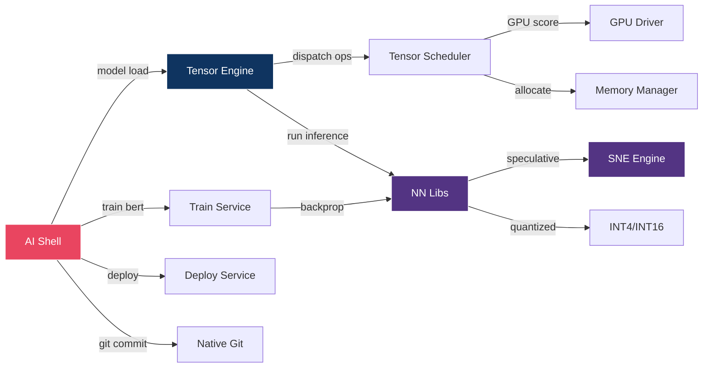

<p align="center">
  
  
  
  
  
  
  
  
</p>

TensorOS is an operating system built from scratch with a single goal: **run AI workloads faster and cheaper, without losing accuracy.** Every layer — from the bootloader to the shell — is designed around tensors, models, and inference as first-class primitives.

Traditional OSes treat AI as just another application. TensorOS treats AI as *the* application.

---

## Architecture Overview

```mermaid
graph TB
    subgraph Userland["<b>Userland</b>"]
        direction LR
        Shell["AI Shell<br/><small>model load &#x2502; infer &#x2502; deploy</small>"]
        Monitor["Monitor<br/><small>GPU/Mem/MEU stats</small>"]
        Deploy["Deploy Service<br/><small>A/B &#x2502; autoscale</small>"]
        Train["Train Service<br/><small>backprop &#x2502; checkpoints</small>"]
    end

    subgraph Runtime["<b>Runtime</b>"]
        direction LR
        Engine["Tensor Engine<br/><small>eager ops &#x2502; compute graphs</small>"]
        JIT["Pseudocode JIT<br/><small>4-tier compilation</small>"]
        NN["Neural Network Libs<br/><small>inference &#x2502; quantize &#x2502; GGUF</small>"]
        SNE["Speculative Neural<br/>Execution<br/><small>5 techniques</small>"]
    end

    subgraph Kernel["<b>Kernel</b>"]
        direction LR
        Sched["Tensor Scheduler<br/><small>MEU-based &#x2502; GPU scoring</small>"]
        MM["Memory Manager<br/><small>tensor zones &#x2502; model cache</small>"]
        Git["Native Git<br/><small>SHA-256 &#x2502; tensor objects</small>"]
        IPC["IPC<br/><small>zero-copy channels</small>"]
        Security["Sandbox<br/><small>permissions &#x2502; audit</small>"]
        Virt["Virtualization<br/><small>VT-x &#x2502; EPT &#x2502; hypercalls</small>"]
    end

    subgraph Drivers["<b>Drivers</b>"]
        direction LR
        GPU["GPU Driver<br/><small>PCI detect &#x2502; dispatch</small>"]
        BT["Bluetooth SPP<br/><small>HCI &#x2502; L2CAP &#x2502; RFCOMM</small>"]
        Net["Network Stack<br/><small>ARP &#x2502; IPv4 &#x2502; UDP &#x2502; ICMP</small>"]
        SD["SD / Block<br/><small>RPi SD &#x2502; virtio-blk</small>"]
        FS["TensorFS<br/><small>AI-aware VFS</small>"]
    end

    subgraph Boot["<b>Boot</b>"]
        direction LR
        x86["x86_64 Multiboot2<br/><small>long mode &#x2502; SSE2 &#x2502; SIMD</small>"]
        arm["ARM64 Boot Stub<br/><small>EL2→EL1 &#x2502; MMU &#x2502; UART</small>"]
        SMP["SMP Bootstrap<br/><small>LAPIC / PSCI</small>"]
    end

    Userland --> Runtime
    Runtime --> Kernel
    Kernel --> Drivers
    Drivers --> Boot

    style Userland fill:#1a1a2e,stroke:#e94560,color:#fff
    style Runtime fill:#16213e,stroke:#0f3460,color:#fff
    style Kernel fill:#0f3460,stroke:#533483,color:#fff
    style Drivers fill:#533483,stroke:#e94560,color:#fff
    style Boot fill:#2c2c54,stroke:#474787,color:#fff
```



### Component Interaction



## Key Innovations

### 1. Model Execution Units (MEUs) Replace Processes

Traditional OSes schedule processes and threads. TensorOS schedules **Model Execution Units** — each MEU encapsulates a model with its weights, compute graph, and I/O. The scheduler understands tensor operations and can:

- **Batch-coalesce** similar operations across MEUs
- **GPU-score** devices based on VRAM, utilization, temperature, and weight locality
- **Priority-schedule** with 6 levels: REALTIME → CRITICAL → HIGH → NORMAL → LOW → IDLE

### 2. Tensor-Aware Memory Manager

Memory is organized into zones optimized for AI:

| Zone | Purpose | Page Size |
|------|---------|-----------|
| `TENSOR` | Active tensor computation | 2MB huge pages |
| `MODEL` | Model weight cache (LRU) | 2MB huge pages |
| `DMA` | GPU/TPU DMA transfers | 4KB, pinned |
| `GIT` | Git object store | 4KB |
| `KERNEL` | Kernel data structures | Slab allocator |

The model weight cache uses LRU eviction with 64 entries, so switching between models is near-instant when weights are already cached.

### 3. Native Kernel-Level Git

Git is not an application — it's a kernel subsystem. Benefits:

- SHA-256 (not SHA-1) computed in kernel space
- Extended object types: `GIT_OBJ_TENSOR` and `GIT_OBJ_MODEL` for native versioning of tensors and model checkpoints
- Training runs automatically create git commits at checkpoint intervals
- Zero-copy: git objects share memory with the tensor heap

### 4. Pseudocode as Default Language

The default runtime uses **Pseudocode** (inspired by [NaguSamecs' Pseudocode](https://github.com/NaguSamecs/Pseudocode)), a language designed to look like natural algorithmic descriptions but compile to efficient tensor operations:

```pseudocode
model transformer:
    layer attention(Q, K, V):
        scores = matmul(Q, transpose(K))
        weights = softmax(scores / sqrt(dim))
        return matmul(weights, V)

    layer feedforward(x):
        h = relu(matmul(x, W1) + b1)
        return matmul(h, W2) + b2

load "llama-3-8b" as llm
result = infer llm with "Explain quantum computing"
print result

train llm on "dataset.jsonl":
    epochs = 3
    learning_rate = 0.0003
    optimizer = adamw
    save every 500 steps

deploy llm on port 8080

git commit "trained llama-3 on custom data"
```

The Pseudocode runtime includes:
- **60+ token types** with AI-specific keywords (`model`, `layer`, `tensor`, `train`, `infer`, `deploy`)
- **Recursive descent parser** producing an AST
- **Tensor IR** with 28 opcodes (MATMUL, CONV2D, ATTENTION, SOFTMAX, etc.)
- **4-tier JIT**: Interpreter → Basic compilation → Optimized → Fully optimized
- **Optimization passes**: Op fusion (matmul+bias+relu), precision auto-downgrade (FP32→FP16)

### 5. Near-Zero-Cost Virtualization

VT-x/AMD-V with EPT/NPT for hardware-accelerated containers:

- **Paravirtualized tensor hypercalls** — guest VMs can request tensor operations from the host without full device emulation
- **IOMMU GPU passthrough** — direct GPU access for containers with near-native performance
- **Shared tensor memory** — containers share a mapped memory region for zero-copy tensor transfer

### 6. Model Package Manager

Like apt/npm but for AI models:

```
tensor> pkg install llama-3-8b
[PKG] Resolving llama-3-8b from tensoros-hub...
[PKG] Downloading: llama-3-8b (4.5 GB, Q4_K_M quantized)
[PKG] Verifying SHA-256...
[PKG] Installing to /models/llama-3-8b/
[PKG] Auto-optimizing for detected hardware (NVIDIA RTX 4090)...
[PKG] Done.

tensor> pkg search "code generation"
Found 12 packages:
  codellama-34b     34B params  Code generation  ★★★★★
  starcoder2-15b    15B params  Code generation  ★★★★☆
  deepseek-coder-v2 16B params  Code + reasoning ★★★★★
```

Registries: `tensoros-hub` (default), `huggingface`.
Supports automatic quantization and hardware-specific optimization on install.

---

## Building

### Prerequisites

| Tool | Purpose | Install |
|------|---------|---------|
| `x86_64-elf-gcc` | Cross-compiler | See [OSDev GCC Cross-Compiler](https://wiki.osdev.org/GCC_Cross-Compiler) |
| `nasm` | Assembler | `apt install nasm` / `choco install nasm` |
| `qemu-system-x86_64` | Emulator | `apt install qemu-system-x86` / `choco install qemu` |
| `grub-mkrescue` | ISO builder (optional) | `apt install grub-pc-bin xorriso` |
| `gdb` | Debugger (optional) | `apt install gdb` |

### Build & Run

```bash
# Build the kernel
make

# Run in QEMU (4GB RAM, 4 CPUs, virtio-gpu)
make run

# Build bootable ISO
make iso

# Debug with GDB
make debug
# In another terminal:
gdb -x .gdbinit build/tensoros.bin
```

### Windows (PowerShell)

```powershell
# Run in QEMU
.\scripts\run-qemu.ps1

# Debug mode
.\scripts\run-qemu.ps1 -Debug

# Boot from ISO
.\scripts\run-qemu.ps1 -Iso
```

---

## Project Structure

```
TensorOS/
├── boot/
│   ├── boot.asm              # Multiboot2 bootloader (x86_64 long mode)
│   ├── arm64/boot.S          # ARM64 boot stub (EL2→EL1, MMU, UART)
│   └── linker.ld             # Linker script with tensor memory regions
├── kernel/
│   ├── core/
│   │   ├── kernel.h          # Core types (tensor_desc_t, MEU, kernel_state)
│   │   ├── main.c            # Kernel entry, 20-phase boot sequence
│   │   ├── klib.c            # Platform HAL (UART, VGA, IDT, PIC, keyboard)
│   │   ├── smp.c             # SMP multi-core bootstrap (LAPIC/PSCI)
│   │   ├── perf.c            # Cycle-accurate performance counters
│   │   ├── exception.c       # ARM64 exception vectors
│   │   ├── watchdog.c        # Hardware watchdog timer
│   │   ├── selftest.c        # Boot-time self-tests
│   │   └── cpu_features.c    # CPUID / feature detection
│   ├── sched/
│   │   └── tensor_sched.c    # MEU scheduling, GPU scoring, batch coalescing
│   ├── mm/
│   │   ├── tensor_mm.c       # Tensor heap, model cache, slab allocator
│   │   └── tensor_arena.c    # Zero-fragmentation arena allocator
│   ├── drivers/
│   │   ├── gpu/gpu.c         # PCI GPU detection, tensor op dispatch
│   │   ├── tpu/tpu.c         # TPU driver stub
│   │   ├── bt/rpi_bt.c       # Bluetooth SPP (PL011→HCI→L2CAP→RFCOMM)
│   │   ├── blk/rpi_sd.c      # RPi4 SD card (EMMC2) driver
│   │   ├── blk/virtio_blk.c  # Virtio block device driver
│   │   ├── blk/sdlog.h       # FAT32 SD boot logger
│   │   └── net/virtio_net.c  # Virtio network device driver
│   ├── net/
│   │   └── netstack.c        # ARP, IPv4, UDP, ICMP, HTTP inference server
│   ├── fs/
│   │   ├── git.c             # Native kernel git (SHA-256, tensor objects)
│   │   └── tensorfs.c        # AI-aware virtual filesystem
│   ├── security/
│   │   └── sandbox.c         # Permissions, audit, deterministic mode
│   ├── ipc/
│   │   └── tensor_ipc.c      # Zero-copy channels, tensor pipelines
│   └── update/
│       └── ota.c             # OTA firmware update (UART/BT)
├── virt/
│   └── virt.c                # VT-x/EPT, GPU passthrough, hypercalls
├── runtime/
│   ├── pseudocode/
│   │   └── pseudocode_jit.c  # Lexer, parser, IR, 4-tier JIT, optimizer
│   ├── tensor/
│   │   ├── tensor_engine.c   # Eager ops, compute graphs, backend selection
│   │   ├── tensor_cpu.c      # SIMD tensor ops (SSE2 / NEON)
│   │   └── tensor_avx2.c     # AVX2-accelerated tensor kernels
│   ├── jit/
│   │   └── x86_jit.c         # x86_64 JIT code emitter
│   └── nn/
│       ├── inference.c        # Forward pass, model loading, benchmarks
│       ├── train.c            # Backpropagation + Adam optimizer
│       ├── quantize.c         # INT16 quantization engine
│       ├── quantize4.c        # INT4 / Q4_K quantization engine
│       ├── gguf.c             # GGUF model format parser + writer
│       ├── speculative.c      # Speculative Neural Execution (5 techniques)
│       ├── transformer.c      # Multi-head attention, transformer blocks
│       └── evolution.c        # Neuroevolution with genetic algorithms
├── pkg/
│   └── modelpkg.c            # Model package manager (registry, install)
├── userland/
│   ├── shell/aishell.c       # Interactive AI shell with 20+ commands
│   ├── monitor/tensor_monitor.c  # GPU/memory/MEU monitoring, alerts
│   ├── deploy/deploy_service.c   # Auto-scaling, health checks, A/B testing
│   └── train/train_service.c     # Distributed training orchestration
├── scripts/
│   ├── run-qemu.sh           # QEMU launcher (Linux/macOS)
│   └── run-qemu.ps1          # QEMU launcher (Windows)
├── build_rpi.ps1             # ARM64 / RPi4 build script (Zig toolchain)
├── Makefile                   # x86_64 build system
└── README.md
```

---

## AI Shell Quick Reference

```
tensor> model load llama-3-8b          # Load model into MEU
tensor> model list                      # Show running MEUs
tensor> infer llama-3-8b "Hello"        # Run inference
tensor> train bert dataset.json         # Launch training
tensor> deploy llama-3-8b --port 8080   # Deploy as service
tensor> git init                        # Initialize git repo
tensor> git commit -m "checkpoint"      # Commit state
tensor> pkg install mistral-7b          # Install model
tensor> monitor                         # System dashboard
tensor> run script.pseudo               # Execute Pseudocode file
tensor> help                            # Full command list
```

Any text that isn't a built-in command is automatically JIT-compiled as Pseudocode.

---

## Design Principles

1. **Tensors are first-class** — Memory, scheduling, IPC, and filesystems all understand tensor shapes and dtypes natively.

2. **Models are the unit of execution** — No processes, threads, or PIDs. Everything is an MEU with a model, weights, and a compute graph.

3. **Zero-copy everywhere** — IPC uses shared memory, git objects live in the tensor heap, GPU passthrough avoids host copies.

4. **Git is infrastructure** — Every training run, deployment, and model change is automatically version-controlled at the kernel level.

5. **Hardware-aware by default** — The scheduler, memory manager, and package manager all auto-optimize for detected hardware (GPU VRAM, tensor cores, thermal limits).

6. **Pseudocode is the interface** — Write what you mean, not how the machine wants it. The JIT figures out the rest.

---

## Roadmap

- [x] Interrupt handler (IDT, PIC/APIC, ARM64 exception vectors)
- [x] PS/2 keyboard driver with scancode set 2
- [x] PCI Express enumeration for GPUs
- [x] Network stack (ARP/IPv4/UDP/ICMP + HTTP inference server)
- [x] GGUF native loader (parse + round-trip)
- [x] Model quantization engine (INT16 + INT4/Q4_K)
- [x] Speculative Neural Execution (5 techniques)
- [x] Backpropagation training engine (SGD + Adam)
- [x] Neuroevolution engine (genetic algorithms)
- [x] SMP multi-core bootstrap (LAPIC + PSCI)
- [x] Bluetooth SPP serial console (HCI → L2CAP → RFCOMM)
- [x] OTA firmware update (ARM64)
- [x] Transformer architecture (multi-head attention)
- [x] ARM64 / Raspberry Pi 4 port
- [x] Arena allocator (zero-fragmentation tensor memory)
- [x] SD card driver (RPi4 EMMC2)
- [ ] NVIDIA GPU driver (MMIO register interface)
- [ ] AMD ROCm-compatible GPU driver
- [ ] Real DMA engine for PCIe transfers
- [ ] TCP transport for model serving
- [ ] Distributed training across multiple machines
- [ ] UEFI boot support
- [ ] Filesystem persistence (disk I/O)
- [ ] Pseudocode standard library
- [ ] WebGPU/Vulkan compute backend
- [ ] ONNX Runtime integration
- [ ] safetensors native loader
- [ ] Flash Attention kernel
- [ ] PagedAttention (vLLM-style) for serving


