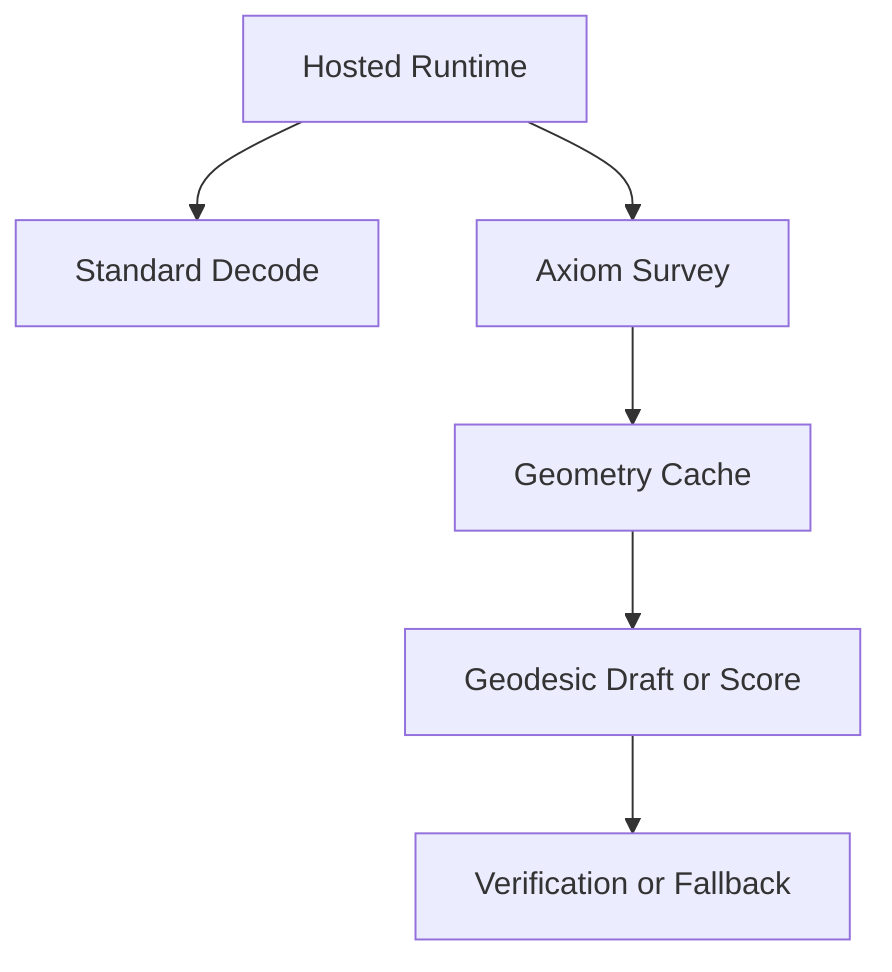

# HyperTensor and Geodessical (Axiom): Brief

This is the short version of the longer architecture paper. Use it when you need the relationship between the hosted runtime and the Axiom stack quickly.

## Short Version

HyperTensor is the hosted transformer runtime. It loads the model, owns the scratch buffers and KV cache, runs the standard forward pass, and samples tokens from the resulting logits. Geodessical is the geometry-aware execution profile built on top of that same runtime. It runs the Axiom survey, caches intrinsic-coordinate geometry, and uses that geometry to draft or score decode steps. Today, the transformer path is still the correctness path.

## Runtime Split

| Topic | HyperTensor | Geodessical / Axiom |
|---|---|---|
| Main job | direct transformer inference | geometric survey plus decode assistance |
| Decode authority | standard forward pass | standard forward pass with geodesic proposals |
| Extra state | KV cache, scratch tensors, logits | all baseline state plus PCA basis, metric field, Christoffel cache, axiom report |
| Current role | production runtime | hybrid and experimental layer |

## One Diagram

## What Ships Today

1. Normal HyperTensor runs the model directly through the standard transformer path.
2. The Axiom subsystem can estimate intrinsic dimension, symmetry, curvature, and an axiom set.
3. Geodessical can reuse cached geometry across runs when the model and survey configuration match.
4. Geodesic-first and speculative modes can draft tokens, but the transformer still verifies or replaces weak drafts.
5. The long-term goal is lower-dimensional geodesic inference, but that is not the default hot path yet.

## Read More

- [HyperTensor and Geodessical Paper](HYPERTENSOR_GEODESSICAL_ARCHITECTURE_PAPER.md)
- [Geodessical Plan](GEODESSICAL_PLAN.md)
- [TensorOS README](../README.md)