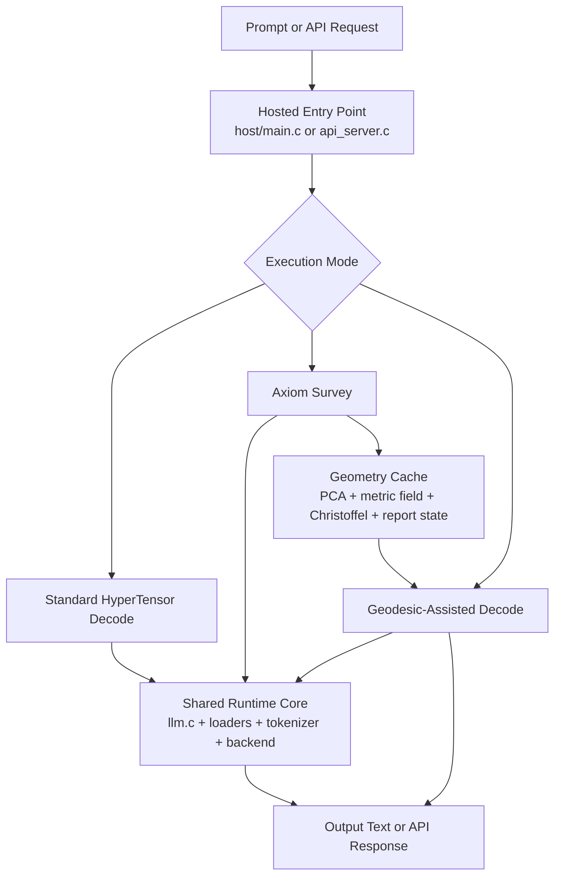
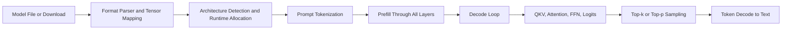
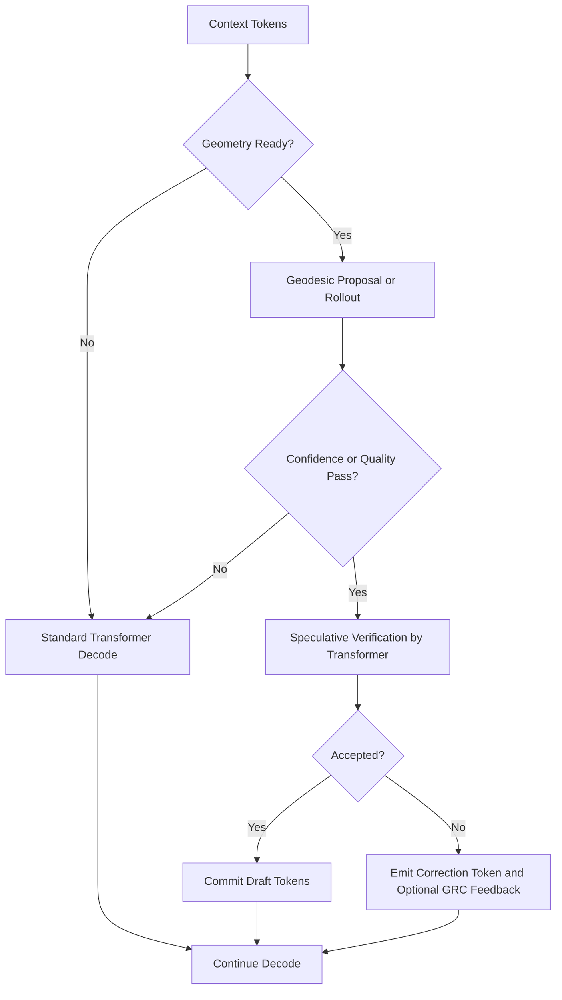

# HyperTensor and Geodessical (Axiom)

## A Whitepaper on Shared Transformer and Geometric Inference Architecture

Status: working architecture paper for the current codebase state as of April 2026. This document is grounded in the code that ships today, not in a future-state pitch.

## Executive Summary

The short version is this: HyperTensor runs the model directly, and Geodessical tries to learn enough geometry about that model to help with decoding. They share the same hosted runtime, the same loader stack, the same tokenizer path, and the same backend abstractions [2][5][6].

The difference is in control flow and retained state. Normal HyperTensor allocates runtime buffers, runs the standard forward pass, and samples tokens from logits. Geodessical adds a five-phase Axiom survey, caches intrinsic-coordinate geometry such as PCA bases and Christoffel symbols, and uses that geometry to assist or propose decode behavior [3][5][7][8].

The current system is still hybrid. The standard transformer path remains the correctness path. Geodessical can survey, cache, and reuse geometry, and it can draft tokens or trajectories, but it still depends on the baseline forward pass for verification and fallback [4][5][8].

## Abstract

This paper describes the architecture of normal HyperTensor and of Geodessical HyperTensor, which is the hosted Axiom and OTT-oriented extension of the same runtime. The useful mental model is layered rather than product-split: one hosted inference substrate, one standard transformer execution path, and one geometry-driven survey and decode-assist layer above it [1][2][3][5][6][7][8].

The analysis shows three things. First, baseline HyperTensor is a systems-oriented transformer runtime with custom quantized kernels, backend abstraction, model-format normalization, token-native execution surfaces, and hosted serving support [2][5][6]. Second, Geodessical is not yet a separate replacement engine; it instruments and reuses the baseline runtime [3][5][7][8]. Third, the Axiom subsystem is already substantial enough to matter architecturally: it can estimate intrinsic dimension, symmetry, curvature, and axiom structure, cache the resulting geometry, and use that geometry to assist decode through geodesic-first and speculative paths [3][7][8][10].

## Keywords

HyperTensor, Geodessical, Axiom, OTT, transformer inference, hosted runtime, geometric inference, geodesic decoding, token-native pipeline, systems architecture.

## 1. Introduction

The repository contains two distinct but tightly coupled ideas.

- The first idea is a hosted inference engine that runs modern decoder models efficiently using a custom runtime.
- The second idea is that a trained model can be treated as a geometric object whose intrinsic structure may support a lower-dimensional inference procedure.

The first idea is already operational. The second is implemented as an experimental but nontrivial architectural layer. The point of this paper is to describe both without blurring the line between what is production code today and what is still a research direction.

In this document, normal HyperTensor means the standard hosted execution path. Geodessical means the runtime profile that enables the Axiom subsystem, geodesic proposal modes, and related OTT-oriented features. The codebase itself uses the name Geodessical for the hosted binary and Axiom for the geometric subsystem that powers the survey and pilot paths [3][5][7][8].

## 2. Sources and Method

This paper is based on three kinds of evidence.

- Repository architecture documentation, especially the general system architecture and irregular-architecture summaries [1][2].
- Axiom-specific planning and performance documents [3][4].
- The actual hosted entry point, forward runtime, and Axiom implementation files [5][6][7][8].

The paper also uses the current JSON report structure as evidence for what the Axiom pipeline exposes in practice, and it uses the TpF reference as a hardware-agnostic efficiency frame for comparing runtime behavior independently of raw tokens per second [9][10].

## 3. Architectural Thesis

The central architectural thesis is simple:

1. HyperTensor and Geodessical share one hosted inference substrate.
2. Normal HyperTensor executes the neural network directly.
3. Geodessical builds geometric state from the network and tries to use that state to assist or eventually replace parts of decode.

Figure 1 illustrates the actual layering more accurately than the common intuition that Geodessical is a second standalone engine.

Figure 1. HyperTensor and Geodessical are layered over the same hosted runtime core.

## 4. Shared Hosted Runtime Substrate

### 4.1 Hosted Execution Model

HyperTensor is the hosted form of the broader TensorOS runtime. Instead of running in a bare-metal environment, it runs as a user-space binary on Windows or Linux and maps kernel-style operations onto host operating-system services through the host HAL [2][5].

Architecturally, this produces a compact but complete hosted stack:

- memory allocation and alignment through the HAL
- mapped-file and disk access through host I/O primitives
- timing through host high-resolution clocks
- sockets and serving through host networking
- the same model runtime abstractions used by the larger codebase

This matters because Geodessical does not introduce a second host abstraction. It inherits the same HAL, memory model, and runtime ownership boundaries.

### 4.2 Unified Model Ingestion

HyperTensor's loader layer is deliberately broader than a minimal single-format runtime. The system supports:

- GGUF loading as the primary production path
- partial SafeTensors support
- minimal ONNX loading
- HuggingFace download support
- model-family inference from metadata and tensor names [2][6]

All of these paths normalize into one internal model descriptor. That descriptor is then consumed by the same forward path in `llm.c` [6]. Geodessical depends on this normalization because its survey logic assumes a stable internal view of model dimensions, layers, vocabulary, and tensor access.

### 4.3 Shared Backend and Execution Abstractions

Both normal HyperTensor and Geodessical reuse the same compute abstractions:

- CPU execution
- optional CUDA execution
- custom quantized arithmetic
- optional x86_64 JIT helpers
- token-native hidden-state and cache instrumentation [2][6]

This reuse is one of the strongest architectural decisions in the system. Instead of branching into a separate research runtime, Axiom reuses the same execution machinery and simply asks it different questions: capture hidden state, run an oracle step, verify a draft batch, or score a reconstructed endpoint.

## 5. Architecture of Normal HyperTensor

### 5.1 Goal and Execution Model

Normal HyperTensor is a hosted transformer inference runtime. Its purpose is to execute the trained network as directly and efficiently as possible, preserving standard decoder semantics while using custom systems-level optimizations where available [2][5][6].

The high-level baseline flow is shown in Figure 2.

Figure 2. Baseline HyperTensor dataflow.

### 5.2 Core Baseline Subsystems

#### 5.2.1 Model Representation and Tensor Mapping

Once the model has been loaded, HyperTensor builds a unified model descriptor containing the information required for the hot path: model family, tensor pointers, layer counts, dimensions, quantization formats, vocabulary metadata, and architecture-specific special cases [2][6]. This is what allows the same hosted runtime to support multiple decoder families without implementing a completely different front end for each one.

#### 5.2.2 Scratch State and KV Cache Ownership

The runtime preallocates and reuses a large amount of scratch state in `llm.c`, including:

- current hidden state and normalized hidden state
- query, key, and value buffers
- attention score buffers
- FFN intermediate buffers
- logits buffers
- token buffers
- KV cache
- optional hidden-state bridge and history buffers [6]

This is a classic systems-runtime design choice. The runtime avoids graph-building overhead in the inner loop and instead works with persistent scratch storage whose shape is determined by the active model.

#### 5.2.3 Forward Pass Engine

The baseline hot path is the direct transformer forward pass in `llm.c` [6]. It handles:

- normalization and RoPE
- attention score computation and KV-cache reuse
- FFN evaluation
- logits projection
- token generation orchestration

Some operations may be offloaded to CUDA or specialized quantized kernels, but the architectural model remains the same: the model is executed directly, layer by layer, step by step.

#### 5.2.4 Decode Loop and Sampling

At the end of each step, the runtime produces logits, samples a token, appends it to context, and continues until an exit condition is hit [5][6]. Normal HyperTensor therefore trusts the learned network itself as the sole authority during decode.

### 5.3 Special Features of the Baseline Runtime

The baseline runtime is not merely a thin transformer wrapper.

#### Custom quantized arithmetic

The system includes fused dequantization and dot-product paths and integer-oriented GEMV implementations. This makes quantized weights part of the native runtime design rather than an external format-conversion artifact [2][6].

#### Optional custom JIT

The repository includes a hand-written x86_64 emitter for a number of vector kernels. Hosted Windows imposes ABI constraints, but architecturally the JIT remains part of the runtime's intended acceleration model [2].

#### Token-native execution surfaces

The system does not force all internal operations through text boundaries. Hidden states, token IDs, logits, and KV snapshots are all first-class internal values. This token-native design is one of the reasons the Axiom subsystem can be integrated without replacing the rest of the runtime [2][6].

#### Tensor bridge

The tensor bridge can capture or inject hidden states at specified layers. In the baseline runtime this is a systems feature. In Geodessical it becomes a foundational mechanism for manifold sampling [2][6][8].

#### API and serving path

The hosted binary can run as a service process. This means the baseline system is already deployable as a normal inference runtime independent of Axiom [4][5].

## 6. Architecture of Geodessical HyperTensor (Axiom)

### 6.1 Goal and Position in the Stack

Geodessical begins from a different operating thesis. Instead of treating the trained model only as a sequence of layer operations, it treats the model as a geometric object that may admit a lower-dimensional description in intrinsic coordinates [3][7][8].

That thesis does not yet replace the baseline runtime. It creates a second layer above it. Geodessical is therefore best described as a geometric survey and decode-assist architecture built on HyperTensor's hosted transformer core.

Figure 3 shows the internal organization of the Axiom subsystem.

```mermaid
flowchart LR
    P1[Phase 1\nManifold Identification]
    P2[Phase 2\nSymmetry Extraction]
    P3[Phase 3\nMetric, Fisher, Curvature]
    P4[Phase 4\nAxiom Formalization]
    P5[Phase 5\nGeodesic Pilot]

    A1[PCA Basis and Intrinsic Dimension]
    A2[Symmetry Scores and Generators]
    A3[Metric Field and Christoffel Cache]
    A4[Axiom Set and Consistency Score]
    A5[Geodesic Quality Metrics and Speedup Estimate]

    P1 --> A1 --> P2
    P2 --> A2 --> P3
    P3 --> A3 --> P4
    P4 --> A4 --> P5
    P5 --> A5
```

Figure 3. The five-phase Axiom survey and its retained artifacts.

### 6.2 Phase-by-Phase Architecture

Table 1 summarizes the operational role of each phase.

| Phase | Objective | Main implementation strategy | Persistent outputs |
|---|---|---|---|
| Phase 1 | find a useful intrinsic subspace | hidden-state or embedding sampling, PCA, TwoNN | PCA basis, intrinsic dimension |
| Phase 2 | find structural redundancy and invariance | dequantized head fingerprints and cosine similarity | symmetry score, generator estimate |
| Phase 3 | build a usable differential-geometric field | local covariance metrics, optional Fisher blend, Christoffel and curvature computation | metric field, Christoffel cache, curvature stats |
| Phase 4 | derive compact rule-like structure | geometry-weighted candidate generation plus oracle checks | axiom count, consistency, information gain |
| Phase 5 | test decode relevance of geometry | geodesic integration, endpoint reconstruction, token scoring | pilot quality metrics, projected speedup |

#### 6.2.1 Phase 1: Manifold Identification

Phase 1 samples token points from the model, preferring captured last-layer hidden states and falling back to embeddings when necessary [8]. It then applies PCA and estimates intrinsic dimension via TwoNN [3][8].

Architecturally, this phase defines the reduced coordinate system used by the rest of the pipeline. Without it, the later geometric phases would have to operate at full model dimension and would be prohibitively expensive.

#### 6.2.2 Phase 2: Symmetry Extraction

Phase 2 dequantizes attention-head Q-weight structure, forms per-head fingerprints, and measures pairwise cosine similarity to detect near-invariant or redundant heads [3][8].

Architecturally, this phase serves two purposes. First, it gives the survey a notion of structural regularity. Second, it feeds Phase 4 with evidence for symmetry-derived axiom candidates.

#### 6.2.3 Phase 3: Curvature and Metric Construction

Phase 3 is the most computationally ambitious phase. It samples points in PCA space, constructs local covariance metrics, optionally blends in a Fisher Information metric, computes Christoffel symbols numerically, and derives curvature statistics [3][7][8].

This phase is also the key caching boundary. When successful, the resulting metric field and Christoffel symbols are retained for later reuse, which makes downstream geodesic experiments possible without rerunning the entire survey every time [7][8].

#### 6.2.4 Phase 4: Axiom Formalization

Phase 4 turns geometric evidence into a compact rule-like description. Candidate axioms are not assigned randomly; their distribution is weighted by earlier phase results, such as explained variance, symmetry score, and curvature signal [3][8]. The phase then uses an active-learning style oracle budget to test uncertain candidates against actual model behavior [8].

Architecturally, this is where Geodessical stops being a descriptive geometry pass and becomes a control-oriented system that attempts to extract reusable regularities from the model.

#### 6.2.5 Phase 5: Geodesic Pilot

Phase 5 reuses Phase 3 geometry when possible, projects test tokens into the intrinsic subspace, initializes a local geodesic velocity, integrates a geodesic, reconstructs an endpoint, and scores candidate tokens against that endpoint [3][8].

This is not yet full geodesic inference, but it is the bridge between survey and execution. Phase 5 is where the subsystem asks whether the discovered geometry is useful enough to inform next-token behavior.

### 6.3 Geodessical Decode Profiles

The hosted entry point exposes multiple geometry-aware runtime profiles [5].

#### Survey-only profile

`--axiom-beta-run` and `--axiom-beta-only` run the geometric survey, emit report data, and optionally exit before normal generation [5][8].

#### Geodesic-first profile

`--axiom-geodesic-first` primes or reuses the geometry cache and attempts geodesic proposals first, but still falls back to the standard transformer path when the geometric path is unavailable or low confidence [5].

#### OTT speculative profile

`--ott-speculative` uses the geometric path to draft candidate tokens or short sequences and then asks the baseline forward engine to verify them [5]. This is architecturally important because it lets the system benefit from geometric proposals without surrendering correctness to an immature inference substitute.

#### OTT full and theorem-style overlays

Additional flags such as `--ott-fast`, `--ott-full`, `--ott-theorem`, `--attnres`, and `--depth-attn` operate as orchestration layers over the same underlying survey and decode primitives [4][5].

## 7. Hybrid Decode Logic and Control Flow

Geodessical's current decode architecture is best captured as a decision-and-verification pipeline rather than a replacement hot path.

Figure 4. Current Geodessical decode is hybrid and verification-based.

This figure explains why the baseline forward pass remains central. The current system is architecturally significant not because it has already replaced transformer decode, but because it can compose geometric proposals with direct-model verification in a single hosted runtime [5][8].

## 8. Special Features and Differentiators

### 8.1 Features shared by both profiles

- Multi-format model ingestion and normalization [2][6]
- Custom quantized arithmetic [2][6]
- Optional CPU, CUDA, and JIT-assisted execution [2][6]
- Token-native internal pipeline surfaces [2][6]
- Hidden-state capture through the tensor bridge [2][6]

### 8.2 Features specific to Geodessical and Axiom

#### Geometry cache reuse

The Axiom subsystem can retain in-process geometry when the effective model and survey configuration match. This is essential because the expensive parts of the survey are not suitable for per-request recomputation [5][8].

#### Geometry serialization

The public Axiom API includes save and load hooks for Phase 3 geometry. Architecturally, this turns geometry from an ephemeral analysis result into a reusable runtime asset [7].

#### Hidden-state-first manifold construction

The survey prefers last-layer hidden states over static embedding rows when possible. That choice places the manifold in the model's actual computation space rather than in a purely lexical lookup space [8].

#### Geodesic feedback memory

Rejected speculative drafts can generate corrective feedback through GRC-related APIs. This is a small but important online-improvement loop inside the hybrid decode architecture [5][7].

#### Knowledge injection hooks

The Axiom API includes controls for local warps, injection strength, warp radius, and recalculation triggers. These hooks are not yet a full training-replacement system, but they define the architecture for future geometry-based model editing [3][7].

#### Oracle-aligned token evaluation

The subsystem can compare geodesic endpoints against real model next-token behavior rather than only abstract manifold targets. This improves the architectural relevance of pilot metrics because evaluation is tied to actual decode behavior [3][8][10].

## 9. Complexity, Performance, and Efficiency Framing

The baseline and Geodessical paths pursue different performance stories.

The baseline transformer path follows the normal decode story: improve throughput, reduce TTFT, manage KV pressure, and optimize kernels and backend behavior [4][6]. The Geodessical path pursues a different long-term target: move from transformer-style decode complexity toward a geodesic computation in a smaller intrinsic subspace [3][8].

This distinction is important because raw tokens per second is not enough to compare architectural quality across these paths. The TpF reference is useful here because it separates hardware capability from runtime efficiency by measuring token yield per unit of theoretically required work [9]. Under that framing:

- the baseline HyperTensor path is evaluated mainly as a direct transformer runtime
- the Geodessical path must eventually be evaluated both as a hybrid proposal system and as a genuinely different inference algorithm

The current Axiom report format already exposes the right kind of architectural bridge metrics: intrinsic dimension, axiom count, geodesic similarity, target ranking metrics, and projected speedup [7][10].

## 10. Current Maturity and Architectural Limits

### 10.1 Implemented today

- normal hosted transformer inference is usable and production-oriented [2][5][6]
- the five-phase Axiom survey is implemented [3][7][8]
- geometry reuse and report generation are implemented [5][7][8][10]
- geodesic-first and speculative decode modes exist [5]
- the runtime can measure token-level pilot quality and projected complexity reduction [7][8][10]

### 10.2 Still hybrid or incomplete

- full geodesic replacement of the transformer hot path is not implemented [3][4][8]
- decode correctness still depends on the baseline forward engine [5][8]
- diffeomorphism construction and boundary handling remain open problems [3]
- Phase 3 cost and numerical conditioning remain significant engineering barriers [3][8][10]

### 10.3 Deployment implication

Geodessical should currently be understood and deployed as a hybrid accelerator and research layer over baseline HyperTensor, not as a fully independent replacement engine [4][5].

## 11. Conclusion

Normal HyperTensor is a compact hosted transformer runtime whose architecture centers on one direct forward engine, unified model loading, reusable scratch state, quantized kernels, optional backend acceleration, and token-native execution surfaces [2][5][6].

Geodessical HyperTensor is an architectural superstructure on top of that engine. It adds a five-phase geometric survey, persistent intrinsic-coordinate state, axiom extraction, geodesic piloting, and hybrid decode strategies such as geodesic-first and speculative verification [3][5][7][8].

The most accurate summary is therefore not that Geodessical replaces HyperTensor, but that it extends HyperTensor with a geometric model of what the baseline transformer is doing and then uses that model to assist decoding. The transformer still anchors correctness today. The geometry stack provides analysis, reusable state, and draft-generation mechanisms that could support a future inference path with a genuinely different complexity profile.

## References

[1] `docs/ARCHITECTURE.md`, "TensorOS - Architecture Deep Dive."

[2] `docs/IRREGULAR_ARCHITECTURE_SUMMARY.md`, "What's Irregular: TensorOS & HyperTensor."

[3] `docs/GEODESSICAL_PLAN.md`, "Geodessical Development Plan - Organic Training Theory."

[4] `BENCHMARK_ANALYSIS.md`, "Geodessical Performance Analysis - April 2026."

[5] `HyperTensor/host/main.c`, hosted CLI, serving, Axiom orchestration, geodesic-first path, and OTT speculative path.

[6] `HyperTensor/runtime/nn/llm.c`, hosted transformer runtime, scratch ownership, backend dispatch, and decode loop.

[7] `HyperTensor/runtime/nn/axiom_beta.h`, Axiom public API, configuration, report schema, geometry persistence hooks, and geodesic helper APIs.

[8] `HyperTensor/runtime/nn/axiom_beta.c`, five-phase Axiom implementation, geodesic pilot, cache reuse, and hybrid survey behavior.

[9] User-provided reference document, "TpF: Tokens per FLOP - A Hardware-Agnostic Efficiency Metric for LLM Inference Runtimes," version 1.0.0.

[10] `axiom_beta_report.json`, current Axiom JSON report format and representative runtime metrics.